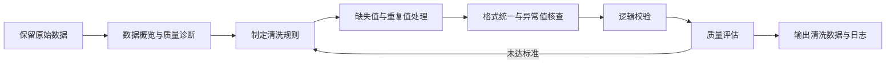

# 数据清洗：让原始数据变得可信、可用

> **词条序号：** 26  
> **姓名：** 董景宇  
> **学号：** 202513093008

## 1. 什么是数据清洗

**数据清洗（Data Cleaning / Data Cleansing）**是发现、判断并修正数据中错误、不完整、不一致、重复或不符合规则内容的过程。它的目标不是把数据“改得好看”，而是在保留真实信息的前提下，使数据达到后续统计分析、可视化或建模所要求的质量标准。

简单来说，原始数据像一份未经校对的调查问卷：其中可能有漏填、重复提交、格式混乱和明显错误。数据清洗就是对这些问题进行系统检查，并依据明确规则处理，同时记录处理过程。

## 2. 为什么需要数据清洗

数据分析的结论依赖输入数据。如果基础数据存在问题，再复杂的模型也可能得到误导性结果，这就是常说的“垃圾进，垃圾出”（Garbage In, Garbage Out）。

在传媒数据研究中，数据清洗尤其常见。例如：

- 社交媒体数据可能含广告账号、机器人账号、重复转发和乱码；
- 问卷数据可能出现漏答、逻辑矛盾或超出量表范围的值；
- 新闻文本可能采用不同日期格式、字符编码或媒体名称；
- 多平台数据合并时，同一用户或事件可能使用不同标识。

清洗会直接影响描述统计、相关关系、模型精度以及研究结论的可信度。

## 3. 常见的数据质量问题与处理方式

| 问题类型 | 典型表现 | 常用处理方式 | 注意事项 |
|---|---|---|---|
| 缺失值 | 年龄为空、正文缺失 | 删除、填补、保留并标记 | 先判断缺失是否具有系统性 |
| 重复数据 | 同一问卷被提交两次 | 按唯一标识或字段组合去重 | 相似记录不一定是真重复 |
| 格式不一致 | `2026/10/8` 与 `2026-10-08` 并存 | 统一日期、编码和单位 | 应保留原始字段便于追溯 |
| 异常值 | 年龄为 999、阅读时长为负数 | 核查、截尾、修正或删除 | 极端值也可能是真实现象 |
| 类别不统一 | “北京”“北京市”“Beijing” | 建立映射表统一编码 | 避免错误合并不同类别 |
| 逻辑冲突 | “未使用平台”却填写使用时长 | 按问卷逻辑复核或设为缺失 | 规则应在分析前写清楚 |
| 文本噪声 | HTML 标签、无意义空格、乱码 | 去标签、规范空白、统一编码 | 不要误删表情或语义符号 |

## 4. 数据清洗的基本流程



### 4.1 保留原始数据

首先保存一份只读的原始数据，后续操作在副本上完成。这样即使清洗规则有误，也可以回到起点重新处理。

### 4.2 数据概览与质量诊断

查看数据规模、字段类型、取值范围、唯一值数量、缺失比例和重复记录数。此阶段强调“先理解，再修改”。

### 4.3 制定清洗规则

处理规则应来自研究设计、问卷编码表、业务知识或可靠外部标准。例如，五点量表的合法范围为 1 至 5，而不是凭感觉删除“不顺眼”的数值。

### 4.4 执行并记录处理

按规则完成类型转换、格式统一、缺失处理、去重、异常核查和逻辑校验。应记录每条规则、影响行数和处理原因，使结果可以复现。

### 4.5 质量复核

清洗后重新计算质量指标，并与清洗前比较。若仍有异常，应回到规则制定环节，而不是直接进入分析。

## 5. 一个具体例子

假设某研究收集了短视频用户问卷，原始数据如下：

| 编号 | 年龄 | 日均使用时长（分钟） | 城市 | 满意度 |
|---|---:|---:|---|---:|
| A01 | 20 | 120 | 北京 | 5 |
| A01 | 20 | 120 | 北京 | 5 |
| A02 |  | 90 | 北京市 | 4 |
| A03 | 999 | -30 | beijing | 8 |

清洗时可以采取以下步骤：

1. 依据编号及其他字段判断第二行是否为重复提交；
2. 将“北京”“北京市”“beijing”映射为统一类别“北京”；
3. 年龄缺失不能随意填写，应结合研究目的选择保留、插补或删除；
4. 年龄 999 和负使用时长违反合理范围，需要回查原始记录；
5. 若满意度量表规定为 1—5，则数值 8 属于非法值，应核查而非直接改成 5。

这个例子说明：**清洗不是机械删除，而是以规则和证据为基础作出判断。**

## 6. 缺失值处理中的判断

设第 $j$ 个变量共有 $n$ 条记录，其中缺失记录数为 $m_j$，则该变量的缺失率为：

$$
r_j = \frac{m_j}{n} \times 100\%
$$

缺失率可以帮助描述问题规模，但不能单独决定处理方式。常见策略包括：

- **删除：** 适用于缺失比例较低且近似随机的情况，但会损失样本；
- **简单填补：** 用均值、中位数或众数填补，操作方便，但可能低估数据变异；
- **模型填补：** 利用其他变量预测缺失值，信息利用更充分，但会引入模型假设；
- **保留并标记：** 新增“是否缺失”变量，适合缺失本身可能有意义的场景。

不同缺失机制会影响结论，因此报告中应说明缺失比例、处理方法及选择理由。技术实现时，也应注意缺失值可能表现为 `NaN`、`None`、`NaT` 或空字符串，不能只检查其中一种形式。

## 7. 数据清洗、数据转换与数据预处理的区别

| 概念 | 核心目的 | 典型操作 |
|---|---|---|
| 数据清洗 | 修复或标记数据质量问题 | 去重、纠错、处理缺失和异常 |
| 数据转换 | 改变数据表示以便使用 | 单位换算、日期解析、类别编码 |
| 数据预处理 | 为具体分析或模型准备数据 | 包含清洗、转换、标准化、抽样等 |

三者彼此关联，但范围不同。数据清洗关注“数据是否可信”，数据转换关注“表示是否合适”，数据预处理则是面向后续任务的更大流程。

## 8. 如何判断清洗是否有效

清洗后的数据不一定“没有任何缺失”，而应满足事先确定的质量要求。可以从以下维度检查：

- **完整性：** 必要字段是否有值；
- **唯一性：** 主键或唯一标识是否重复；
- **有效性：** 数值、日期和类别是否符合规则；
- **一致性：** 不同字段和不同数据源之间是否矛盾；
- **准确性：** 数据是否与真实对象或权威来源相符；
- **可追溯性：** 是否能说明某个值为何被修改或删除。

例如，若共有 $N$ 条记录，其中 $V$ 条通过全部校验规则，则规则通过率可写为：

$$
q = \frac{V}{N} \times 100\%
$$

不过，单一指标不能概括全部质量，应结合多个维度共同判断。

## 9. 使用 Python 进行简单清洗

下面的示例展示了常见操作。真实研究中，应先根据数据含义确定规则，再编写代码。

```python
import pandas as pd

df = pd.read_csv("survey.csv")

# 统一字段名和字符串两端空格
df.columns = df.columns.str.strip()
df["城市"] = df["城市"].astype("string").str.strip()

# 统一类别名称
city_map = {"北京市": "北京", "beijing": "北京"}
df["城市"] = df["城市"].replace(city_map)

# 将非法值标记为缺失，等待进一步核查
df.loc[~df["年龄"].between(10, 100), "年龄"] = pd.NA
df.loc[df["日均使用时长（分钟）"] < 0, "日均使用时长（分钟）"] = pd.NA
df.loc[~df["满意度"].between(1, 5), "满意度"] = pd.NA

# 根据业务主键去重，并生成质量摘要
df = df.drop_duplicates(subset=["编号"], keep="first")
quality_report = df.isna().mean().rename("缺失率")

df.to_csv("survey_clean.csv", index=False)
quality_report.to_csv("quality_report.csv")
```

## 10. 常见误区

1. **把所有缺失值都填成 0。** 0 是一个具体数值，通常不等于“未知”。
2. **发现异常值就删除。** 异常值可能是录入错误，也可能是真实且重要的少数现象。
3. **只保留清洗后的文件。** 缺少原始数据和日志会使研究无法追溯。
4. **反复手工修改表格。** 手工操作难以复现，较大数据集应尽量使用脚本或保存操作历史。
5. **清洗过程中偷看结论并调整规则。** 为得到理想结果而改变规则，会造成研究偏差。
6. **忽视隐私与伦理。** 数据清洗也应遵守最小必要原则，对姓名、手机号等直接标识符进行删除或脱敏。

## 11. 简明总结

数据清洗是把原始数据转化为可信分析材料的关键环节，其核心不是“删掉坏数据”，而是：

> **识别问题 → 制定规则 → 谨慎处理 → 验证结果 → 留下记录**

高质量的数据清洗应当有依据、可复现、可验证、可追溯。只有清楚数据经历了什么，分析者才能对最终结论保持信心。

## 参考资料

1. pandas documentation. [Working with missing data](https://pandas.pydata.org/docs/user_guide/missing_data.html).
2. OpenRefine documentation. [Cell editing](https://openrefine.org/docs/manual/cellediting).
3. Great Expectations documentation. [Try GX Core](https://docs.greatexpectations.io/docs/core/introduction/try_gx/).

