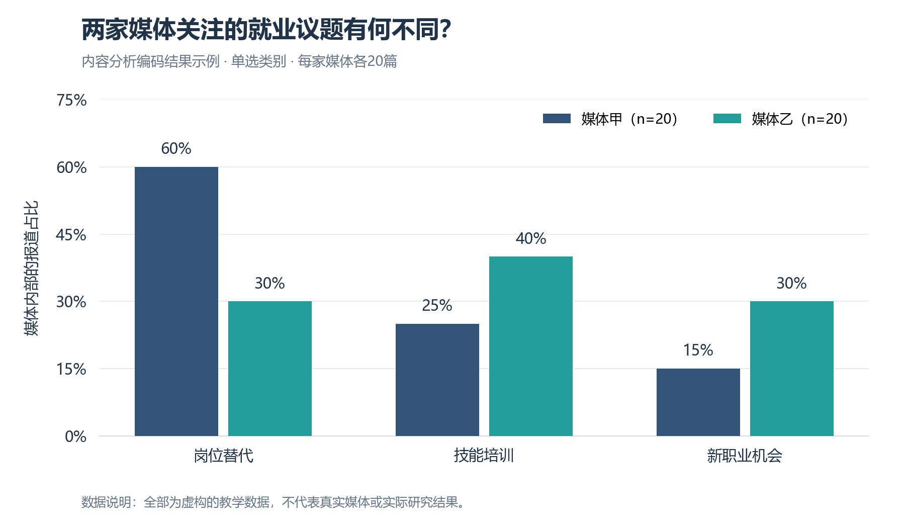
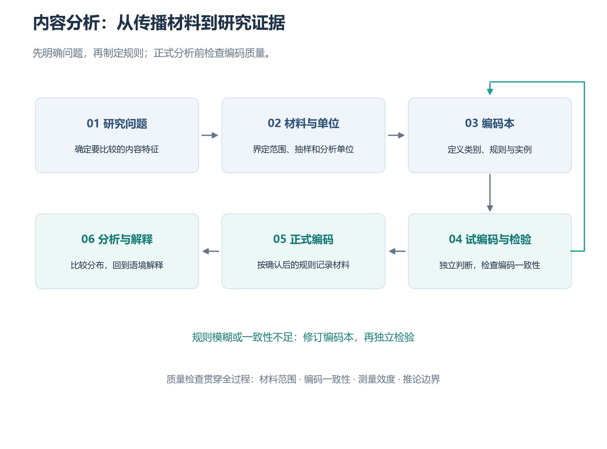

# 40 内容分析（Content Analysis）

姓名：张兆麟  
学号：202513093013  
词条序号：40

## 一、定义名词

**内容分析**是一种按照明确的研究问题和分析规则，系统地考察文本、图像、音频、视频等传播内容，从中识别特征、归纳意义并形成研究结论的方法。Krippendorff 强调，内容分析应当能够从材料中作出可重复、有效且联系其使用情境的推论。[1]

例如，研究者想知道新闻媒体如何报道“人工智能与就业”，可以收集报道，制定判断规则，再记录每篇报道讨论了什么、引用了谁、如何描述就业变化。这样，原本分散的文章就成为能够比较的材料。

内容分析既可以采用定量方式，统计类别的数量和比例，也可以采用定性方式，解释材料中的主题、意义和表达方式。[2][3] 定量研究尤其重视编码规则与编码一致性；定性研究则需要说明解释过程、材料依据和研究者的判断。两种方式都要求分析过程有据可查。

理解这个概念，需要区分三个要素：**分析材料、编码规则和研究推论**。材料提供观察对象；编码规则规定怎样判断；研究推论说明这些内容特征意味着什么。例如，“某媒体经常引用企业管理者”是内容特征，而“这种信源结构如何影响就业议题的呈现”是需要进一步解释的问题。

## 二、背景和上下文

### 2.1 方法背景

内容分析长期用于传播研究，特别适合研究新闻报道、政治宣传、广告和大众文化作品。随着数字媒体发展，研究材料扩展到社交媒体帖子、评论、短视频、播客和平台页面。材料形式改变了，但研究者仍然需要明确：研究哪些内容，依据什么规则分析，以及结论适用于什么范围。[1][2]

在传媒数据学中，内容分析连接传播问题与数据处理。新闻正文原本是自然语言材料，研究者可以将“是否引用专家”“主要讨论哪类风险”“是否提出政策建议”等特征编码成变量，然后进行统计和比较。对于图片或视频，也可以记录画面中的人物、场景、字幕和声音特征。

### 2.2 典型应用场景

| 场景 | 可以提出的问题 | 可分析的内容特征 |
|---|---|---|
| 新闻报道 | 不同媒体怎样呈现同一公共议题？ | 主题、信源、责任归因、解决建议 |
| 社交媒体 | 用户讨论某事件时关注什么？ | 观点、论据、情绪表达、互动对象 |
| 广告研究 | 广告如何表现不同群体？ | 人物角色、职业、形象与叙事位置 |
| 健康传播 | 健康信息是否提供可操作的建议？ | 风险说明、证据来源、行动建议 |
| 短视频研究 | 视频通过哪些方式解释新闻事件？ | 口播内容、字幕、画面、背景音乐 |

内容分析的价值在于使判断过程公开、可比较。读者不仅能看到结论，还能知道材料如何被选取、类别如何被界定、研究者如何处理歧义。

## 三、举例说明：分析“人工智能与就业”的新闻报道

### 3.1 明确问题与材料范围

假设研究问题为：**媒体甲与媒体乙在报道人工智能和就业时，主要关注的议题是否不同？**

可以设计一个教学示例：选取同一月份、同一检索条件下的两家媒体报道，各取 20 篇，以每篇完整报道作为编码单位。实际研究应先定义检索词、纳入标准和抽样方法；不能因为某篇文章符合预期就将其选入。

**本节文章片段与数量均为虚构的教学示例，不代表真实媒体的报道，也不是实际采集的研究结果。**

### 3.2 制定编码规则

为了比较主要关注点，可以设置一个变量“主要议题”，并编写简短编码本：

| 编码 | 类别 | 操作性定义 | 示例线索 |
|---|---|---|---|
| 1 | 岗位替代 | 核心讨论 AI 对现有岗位数量或工作任务的替代 | 自动化、岗位减少、工作被替代 |
| 2 | 技能培训 | 核心讨论从业者学习技能、再培训或教育调整 | 培训课程、技能更新、职业教育 |
| 3 | 新职业机会 | 核心讨论新技术带来的新增职业或岗位需求 | 新职业、新岗位、招聘需求 |
| 4 | 其他或无法判断 | 不符合前三类，或无法依据材料确定主要议题 | 多议题并列且无明显主次 |

这里统计的是报道“主要讨论什么”。出现某个词，并不自动决定类别。例如，“企业推出培训计划，以减少自动化造成的失业”同时涉及替代和培训，需要结合报道的主旨、篇幅与论述重心判断。若无法判断，应使用预先设置的类别并保留说明。

本例采取单选编码，每篇文章只归入一个主要议题类别。如果研究目标是记录所有出现的议题，则应改成多个二元变量，例如“是否讨论岗位替代：是/否”。这两种设计对应不同问题，比例的解释也不同。

### 3.3 将内容转化为记录

| 文章编号 | 媒体 | 虚构报道的主要内容 | 主要议题编码 |
|---|---|---|---:|
| A01 | 甲 | 自动化系统改变客服工作，部分传统任务被替代 | 1 |
| A02 | 甲 | 职业院校开设课程，帮助从业者学习 AI 工具 | 2 |
| B01 | 乙 | 企业招聘 AI 应用顾问，形成新的岗位需求 | 3 |
| B02 | 乙 | 企业为员工安排技能更新与转岗培训 | 2 |

这一步称为**编码**，即依据事先规定的规则，将材料中的特征记录下来。编码本应当说明判断依据，而不是只提供类别名称。

### 3.4 统计与解释

假设 40 篇虚构报道的编码汇总如下，且本例没有文章进入“其他或无法判断”类别：

| 主要议题 | 媒体甲（篇） | 媒体乙（篇） | 甲内部占比 | 乙内部占比 |
|---|---:|---:|---:|---:|
| 岗位替代 | 12 | 6 | 60% | 30% |
| 技能培训 | 5 | 8 | 25% | 40% |
| 新职业机会 | 3 | 6 | 15% | 30% |
| 合计 | 20 | 20 | 100% | 100% |

某媒体内部第 $k$ 类议题的比例可以写为：

$$
p_{jk}=\frac{n_{jk}}{N_j}\times 100\%
$$

其中，$n_{jk}$ 表示媒体 $j$ 中归入第 $k$ 类的报道数量，$N_j$ 表示该媒体纳入分析的报道总数。例如，媒体甲“岗位替代”的比例为 $12/20\times100\%=60\%$。

*图1：虚构的教学示例。每家媒体各20篇报道，柱高表示该媒体内部的类别占比。图由 Python Matplotlib 绘制，数据与上表一致。*

在这一示例中，甲的报道更集中于岗位替代，乙的议题分布相对分散。这一描述只涉及样本中的内容分布。由于数据是虚构的，不能据此评价真实媒体；即便使用真实数据，也不能只凭这样的比较断言媒体的报道改变了受众态度。要研究传播效果，需要进一步采用问卷、实验或其他适当的研究设计。

## 四、对比分析

### 4.1 与相关研究方法的区别

| 方法或概念 | 主要研究对象 | 典型问题 | 与内容分析的关系 |
|---|---|---|---|
| 内容分析 | 已存在的传播内容 | 内容中出现了哪些特征，如何分布或表达？ | 本词条所解释的方法 |
| 问卷调查 | 受访者的回答 | 人们持有什么态度，报告了什么经历？ | 可与内容分析结合，但自述态度与传播内容属于不同材料 |
| 实验研究 | 操纵条件后的反应 | 接触不同内容是否导致不同反应？ | 可使用内容分析确定刺激材料特征，再检验效果 |
| 词频分析 | 词语及其出现次数 | 哪些词出现得多？ | 可成为内容分析的工具，但词频本身未必反映完整意义 |
| 话语分析 | 语言表达及其社会情境 | 表达如何建构身份、关系与权力？ | 与定性内容分析存在交叉，具体边界取决于理论与研究设计 |

例如，“就业”出现 100 次，只能说明这个词出现的频率。要区分报道主要讨论岗位替代、技能培训还是新职业机会，还需要类别定义和上下文判断。

### 4.2 定量与定性内容分析

定量内容分析通常将特征编码为变量，用数量、比例或统计关系进行比较。例如，比较不同媒体引用专家的比例。

定性内容分析更强调意义的解释。例如，分析新闻如何描述求职者的困境，以及哪些经验被纳入叙述。Hsieh 与 Shannon 区分了常规、定向和总结式定性内容分析，它们在类别形成方式、理论使用和解释路径上有所不同。[3]

两者可以结合使用：先通过阅读材料形成候选类别，再用规范化编码比较分布，最后回到原文解释差异。但应明确每一步的用途，避免把统计结果与解释性判断混在一起。

## 五、深入扩展：实施步骤与方法边界

### 5.1 基本流程

*图2：内容分析实施流程示意图。试编码发现规则模糊或一致性不足时，应修订编码本，并用新的独立编码检查修订效果。*

实际开展研究时，可以依次完成以下工作：

1. **提出研究问题。** 确定比较对象与研究目标，例如研究议题分布、信源结构或责任归因。
2. **确定材料与抽样。** 说明平台、时间范围、检索条件、纳入与排除标准；去除重复转载或说明其处理方式。
3. **定义分析单位。** 区分抽样单位、编码单位和上下文单位。例如，抽取整篇报道，对其中每条引语编码，并结合全文判断引语的含义。
4. **建立编码本。** 写出变量、类别、操作性定义、判断规则和正反例。单选类别应尽量互斥，并覆盖可能出现的材料。
5. **进行试编码。** 在覆盖主要材料类型的样本上检验规则，记录歧义和分歧；修订后重新检查。
6. **检验一致性并正式编码。** 在适当的共同样本上，让编码者独立判断，报告一致性指标和实际计算范围，再完成其余材料的编码。
7. **分析与解释。** 比较内容特征，回到原文检查解释是否合理，同时说明抽样范围、测量误差和推论边界。

### 5.2 为什么需要编码一致性

如果两名编码者依据同一编码本，却对同一材料作出大量不同判断，那么类别规则可能不够清楚。编码者之间的一致性是内容分析的重要质量问题。[4]

对于两名编码者共同判断同一批材料、使用无序类别且记录完整的情况，可以使用 Cohen 的 Kappa：

$$
\kappa=\frac{P_o-P_e}{1-P_e}
$$

其中，$P_o$ 是观察到的一致比例，$P_e$ 是根据两名编码者各自的类别分布计算出的偶然一致比例。例如，若 $P_o=0.85$、$P_e=0.50$，则 $\kappa=0.70$。这一数值只是公式演示，不能当作前面虚构媒体案例已经通过一致性检验的证据。[5]

研究有多名编码者、缺失判断或不同测量尺度时，可考虑 Krippendorff 的 Alpha 等适合的指标。[1] 指标选择应与研究设计相匹配；同时报告样本量、类别分布和计算方法，不能将某个阈值机械地用于所有研究。

编码一致性较高，说明规则能够被相对稳定地使用，却不能单独证明变量测量有效。例如，两个人都按照同样的错误规则判断，结果也可能高度一致。因此，还要检查变量是否真正对应研究概念。

### 5.3 自动化工具如何参与

在材料较多时，可以使用关键词规则、机器学习或大语言模型辅助编码。研究者仍然需要定义变量，并用独立的人工标注材料检验工具的表现。

例如，自动识别“是否引用专家”时，应检查工具能否区分专家本人发言、记者转述和只提到专家姓名。对于隐含意义、讽刺或复杂责任归因，单靠关键词往往不足。模型输出还应记录工具版本、提示词或规则，便于复核。

人工编码一致性与自动分类准确率回答不同问题：前者检查不同编码者判断的稳定性，后者检查模型相对于参考标注的表现。两者都需要合适的验证材料。

### 5.4 常见误区与局限

**第一，材料范围影响结论。** 只分析少数账号、某个月份或热门帖子，结果就应限制在这些材料及其抽样设计支持的范围内。热门内容不能自然代表所有内容。

**第二，文本特征不能直接证明受众效果。** 发现报道频繁强调风险，可以说明风险在内容中较突出；要判断读者是否因此更担忧，还需要研究读者的接触与反应。

**第三，类别需要与问题匹配。** “正面、负面、中性”并不适合回答所有传播问题。研究信源、议题或责任归因时，应分别建立相关变量。

**第四，显性内容与隐含意义需要不同判断依据。** “是否出现某个词”相对容易判定，“是否暗示某个主体应承担责任”则需要更充分的上下文和更详细的编码说明。

**第五，公开材料也可能涉及个人隐私。** 分析普通用户的评论时，应考虑引用原文是否会使用户被搜索定位，并根据材料的敏感程度处理身份与呈现方式。

## 六、简明总结

内容分析通过明确的规则，将传播材料转化为可以比较、统计或解释的研究证据。它可以帮助传媒数据学研究新闻议题、信源结构、社交媒体表达和视听内容特征。

使用这一方法时，应首先确定研究问题和材料范围，再定义分析单位、建立编码本并检查编码质量。文章中的数量和类别只有放回具体语境，才能得到合理解释；关于受众态度与行为的结论，还需要相应的效果研究证据。

## 参考文献

[1] Krippendorff, K. (2019). *Content Analysis: An Introduction to Its Methodology* (4th ed.). SAGE Publications. https://doi.org/10.4135/9781071878781

[2] Neuendorf, K. A. (2017). *The Content Analysis Guidebook* (2nd ed.). SAGE Publications. https://doi.org/10.4135/9781071802878

[3] Hsieh, H.-F., & Shannon, S. E. (2005). Three approaches to qualitative content analysis. *Qualitative Health Research*, 15(9), 1277–1288. https://doi.org/10.1177/1049732305276687

[4] Lombard, M., Snyder-Duch, J., & Bracken, C. C. (2002). Content analysis in mass communication: Assessment and reporting of intercoder reliability. *Human Communication Research*, 28(4), 587–604. https://doi.org/10.1111/j.1468-2958.2002.tb00826.x

[5] Cohen, J. (1960). A coefficient of agreement for nominal scales. *Educational and Psychological Measurement*, 20(1), 37–46. https://doi.org/10.1177/001316446002000104
