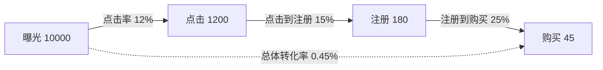
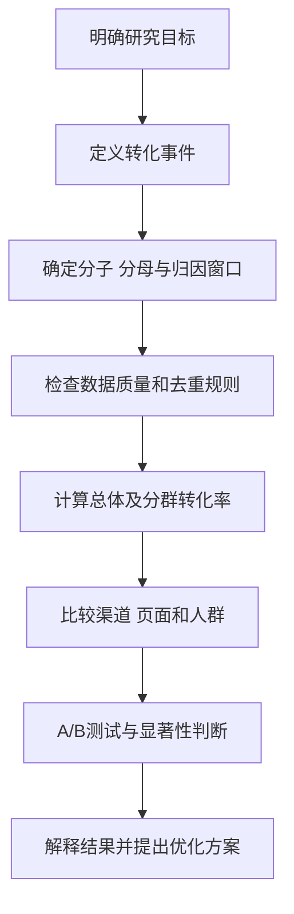

# 转化率

## 基本信息

- 姓名：刘静怡
- 学号：202513093069
- 名词：转化率（Conversion Rate，CVR）

## 一、定义

转化率是指在一定统计范围和时间内，完成预设目标行为的用户数或行为次数，占进入统计范围的用户数或行为次数的比例。目标行为可以是购买、注册、订阅、下载、填写问卷、报名活动或分享内容等。

$$
\text{转化率}=\frac{\text{完成目标行为的用户数或次数}}{\text{进入统计范围的用户数或次数}}\times100\%
$$

使用公式时必须同时说明转化事件、分子、分母和统计时间。例如，以独立访问用户数为分母得到用户转化率，以访问次数为分母得到会话转化率；两者的统计口径不同，不能直接比较。

## 二、背景和应用场景

转化率广泛用于数字营销、电子商务、传播效果评估、产品运营和公共传播。曝光量只能说明信息被看见的规模，点击量只能说明受众产生了进一步兴趣，而转化率关注受众是否完成了传播者预先设定的行动。

常见的转化事件包括：

- 电商：加入购物车、提交订单、完成支付；
- 内容平台：关注、订阅、收藏、评论或分享；
- 移动应用：安装、注册、首次使用或付费；
- 政务与公益：填写问卷、报名活动或完成捐赠。

转化率的价值不只在于给出一个百分比，还在于帮助研究者定位传播漏斗中的流失环节，并比较不同渠道、人群和页面方案的效果。

## 三、转化漏斗与图示

用户通常要经历“曝光—点击—注册—购买”等连续阶段。每个阶段都可以计算阶段转化率，最终转化率则反映从入口到目标行为的整体效果。

图 1  转化漏斗示意图。每条箭头对应一个阶段转化率，虚线表示从曝光到购买的总体转化率。

阶段转化率的通用公式为：

$$
\text{阶段转化率}_i=\frac{N_{i+1}}{N_i}\times100\%
$$

其中，N_i 表示进入第 i 个阶段的用户数，N_{i+1} 表示进入下一阶段的用户数。漏斗分析比单独观察最终转化率更容易发现问题。

## 四、具体案例与计算

### 4.1 传播漏斗案例

一条广告获得 10,000 次曝光，其中 1,200 人点击，180 人注册，最终有 45 人购买。各环节的转化率为：

$$
\text{点击率}=\frac{1200}{10000}\times100\%=12\%
$$

$$
\text{点击到注册转化率}=\frac{180}{1200}\times100\%=15\%
$$

$$
\text{注册到购买转化率}=\frac{45}{180}\times100\%=25\%
$$

$$
\text{曝光到购买总体转化率}=\frac{45}{10000}\times100\%=0.45\%
$$

这个例子说明，最终转化率较低不一定意味着入口广告无效，也可能是注册或支付环节造成了较多流失。因此应按阶段诊断，而不是只看一个总体百分比。

### 4.2 多渠道比较案例

| 渠道 | 进入人数 | 完成目标人数 | 渠道转化率 |
| --- | ---: | ---: | ---: |
| A | 1,200 | 72 | 6% |
| B | 1,500 | 60 | 4% |
| C | 800 | 64 | 8% |
| 合计 | 3,500 | 196 | 5.6% |

渠道 A 的转化率为 72 / 1,200 = 6%。总体转化率应按人数加权计算：196 / 3,500 ≈ 5.6%。不能直接把三个渠道的百分比相加再除以 3，因为各渠道的进入人数不同。渠道 C 的转化率最高，但渠道 A 带来的转化人数更多，因此还需要结合渠道成本、用户质量和规模做判断。

## 五、与相关指标的对比

| 指标 | 计算方式 | 主要回答的问题 |
| --- | --- | --- |
| 点击率（CTR） | 点击次数 ÷ 曝光次数 | 内容是否吸引用户点击？ |
| 转化率（CVR） | 完成目标行为数 ÷ 进入统计范围的用户数或次数 | 用户是否完成预期行动？ |
| 跳出率 | 单页会话数 ÷ 总会话数 | 用户是否很快离开？ |
| 留存率 | 观察期后仍活跃用户数 ÷ 初始用户数 | 用户是否持续使用？ |
| 收益指标 | 总收入 ÷ 订单数或用户数 | 转化之后产生了多少价值？ |

点击率高不一定代表转化率高。标题很吸引人可能带来大量点击，但如果落地页与标题不一致，用户仍可能不注册或不购买。转化率更接近目标行为，但也不能替代留存率和收益指标。

## 六、转化率分析流程

图 2  转化率分析流程图。该流程强调先统一口径，再进行比较，避免把统计定义问题误判为传播效果差异。

### 6.1 统一统计口径

分子与分母必须属于同一时间范围和同一统计对象。若分子统计的是独立购买用户，分母也应尽量使用独立访问用户，而不能将用户数与访问次数混用。

### 6.2 区分人数和次数

同一用户可能多次访问、点击或下单。研究用户覆盖率时通常需要去重，研究页面或广告的行为次数时则可以使用次数口径。报告中应明确写出“人数”还是“次数”。

### 6.3 规定归因窗口

用户看到广告后可能不会立即购买，因此需要规定行为在多长时间内可以归因给该广告。例如，可以设置为点击后 7 天或曝光后 24 小时。不同归因窗口会导致不同的转化率，比较时必须保持一致。

## 七、A/B 测试与统计不确定性

设方案 A 的转化率为 p_A，方案 B 的转化率为 p_B，则 B 相对 A 的提升率为：

$$
\text{相对提升率}=\frac{p_B-p_A}{p_A}\times100\%
$$

例如，方案 A 为 4%，方案 B 为 5%，相对提升率为 25%，但绝对提升只有 1 个百分点，报告中应同时说明两种变化。

若样本量为 n，估计转化率为 p，标准误可近似表示为：

$$SE(p) = \sqrt{p(1-p)/n}$$

样本量较大时，约 95% 的置信区间可近似写为：

$$p \pm 1.96 \times SE(p)$$

因此，两个方案的百分比不同，并不自动意味着存在可靠的因果差异，还要检查样本量、置信区间和实验设计。

## 八、影响因素与局限

1. 短期转化上升不一定带来长期留存或更高收益。
2. 更换分母、去重规则或归因窗口会改变转化率。
3. 小样本中的少数转化事件可能造成百分比剧烈波动。
4. 相关关系不等于因果关系，渠道差异可能来自受众结构不同。
5. 总体平均值可能掩盖地区、设备和人群之间的差异。

## 九、简明总结

转化率是完成目标行为的用户数或次数与进入统计范围的用户数或次数之比。正确分析转化率需要先定义事件和统计口径，用转化漏斗定位流失环节，用加权总体转化率比较不同规模的渠道，并结合 A/B 测试、置信区间、留存和收益指标解释结果。

本修订版在原有定义、背景、公式和对比分析的基础上，补充了多渠道计算案例，并用 Mermaid 图示呈现转化漏斗和分析流程，使概念、计算和实际分析步骤更加直观。
