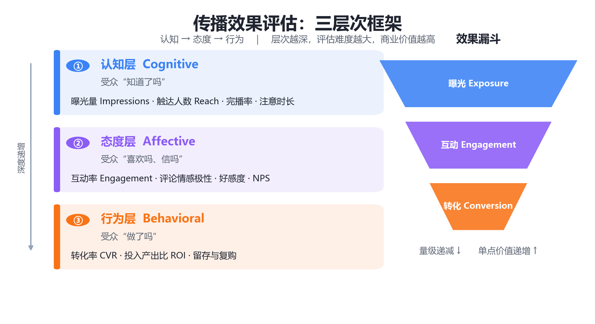
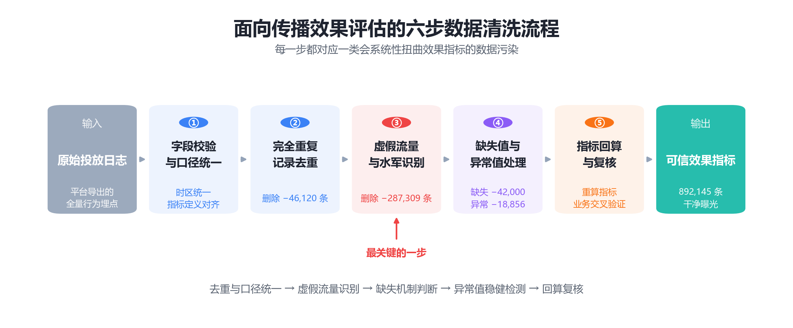
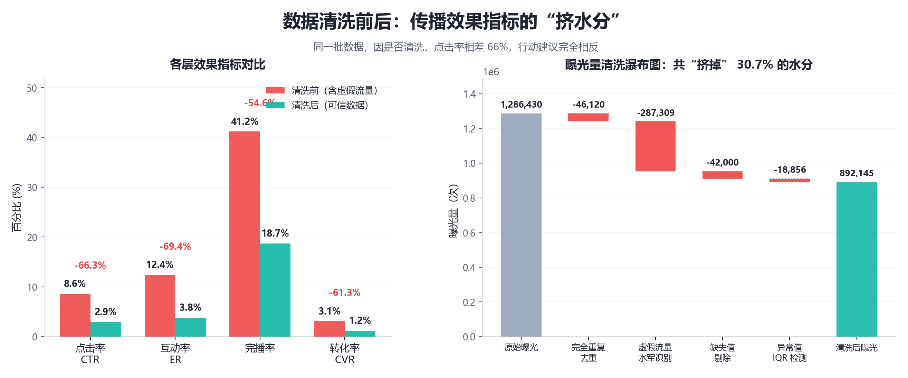

# 传播效果评估

## 基本信息

- 姓名：孙轼淇
- 学号：202513093019
- 名词：传播效果评估（Communication Effect Evaluation）
- 认领序号：70

**关键词**：传播效果评估、效果测量、指标体系、数据清洗、虚假流量识别

---

## 一、定义

**传播效果评估（Communication Effect Evaluation / Measurement）**，是指运用系统的测量方法与数据手段，对传播活动（一条信息、一次投放、一场宣传活动）在受众身上实际产生的**影响及其程度**进行**量化描述与因果判断**的过程。

拆开来看，它包含三个不可省略的成分：

| 成分 | 含义 | 要回答的问题 |
| --- | --- | --- |
| **测量对象** | 受众的认知、态度与行为变化 | 变化发生在哪里？ |
| **测量手段** | 指标体系 + 统计模型 + 数据清洗 | 用什么数据、怎么算？ |
| **判断结论** | 效果大小、是否显著、是否由传播导致 | 变化是不是"传播带来的"？ |

如果只用一个式子概括传播效果评估的底层逻辑，它可以写成：

$$
\text{传播效果} = f\big(\mathbf{X}_{\text{传播刺激}},\ \mathbf{Z}_{\text{受众与情境}}\big) + \varepsilon
$$

其中 $\mathbf{X}$ 表示传播刺激（内容、渠道、频次、预算等），$\mathbf{Z}$ 表示受众特征与外部情境（人群结构、季节性、竞品动作等），$\varepsilon$ 为随机扰动。**评估的本质，就是从充满噪声的 $\varepsilon$ 中，把 $\mathbf{X}$ 的真实贡献分离出来。**

> **一句话版本**：传播效果评估，就是用可信的数据回答"这次传播到底有没有用、有多大用、为什么有用"。

---

## 二、背景与上下文

### 2.1 学术脉络：从"魔弹"到"可测量"

传播效果研究是传播学的核心命题之一，其理论认识经历了三次明显转向：

1. **强效果阶段（20 世纪初—1930s）**：以"魔弹论 / 皮下注射论"为代表，认为媒介信息对受众具有直接、强大、均质的刺激效果。
2. **有限效果阶段（1940s—1970s）**：拉扎斯菲尔德等人的伊里调查、霍夫兰的说服实验、卡兹的"使用与满足"研究，证明受众存在选择性接触与中介因素，效果是**有限且有条件**的。这一阶段最大的贡献是：**效果必须被经验地测量，而不能被想当然地假定。**
3. **适度效果与强大效果阶段（1970s 至今）**：议程设置、涵化理论、沉默的螺旋等表明，媒介的长期、累积、认知层面的效果依然强大。

每一次转向，都把"效果评估"从哲学思辨推向**实证测量**。

### 2.2 现代场景：从"媒介效果"到"数据效果"

进入平台化、算法化的传播环境后，效果评估的重心发生了两点变化：

- **评估对象变了**：从"大众媒介对社会的长期影响"，转向"单次内容投放的即时转化"。
- **评估依据变了**：从抽样问卷，转向**全量的平台行为日志**（曝光、点击、停留、互动、转化埋点）。

这使得传播效果评估成为**数据密集型的交叉工作**——它同时需要传播学的理论框架、统计学的因果推断工具，以及数据工程的数据质量保障。

### 2.3 为什么数据清洗是评估的"第一道闸门"

平台原始日志天然带有大量噪声，而效果指标几乎全是**比率型指标**（点击率、互动率、转化率），这类指标对分子分母的污染极为敏感：

- 分母（曝光量）中混入**机器人流量**，会系统性**低估**真实效果；
- 分子（点击、互动）中混入**水军刷量**，会系统性**高估**真实效果；
- 字段口径不一致、时区错乱、重复上报，会同时污染分子与分母。

> 因此业界有一句共识：**"传播效果评估的成败，八成取决于数据清洗。"** 一份未经清洗的报表，往往不是"略有偏差"，而是"结论完全相反"。

---

## 三、核心框架：传播效果的三层次

传播学界普遍采用的经典分解，是把传播效果按受众反应的深度划为三个层次——**认知层 → 态度层 → 行为层**（常称 CAB 模型：Cognition–Affect–Behavior）。层次越深，评估难度越大，但商业价值也越高。

*图 1　传播效果评估的三层次框架：从认知（曝光触达），到态度（情感认同），再到行为（转化沉淀）。*

### 3.1 认知层（Cognitive）：受众"知道了吗"

反映信息是否被送达与接收，是最基础、量最大的一层。

- **曝光量（Impressions）**：内容被展示的总次数
- **触达人数（Reach / UV）**：去重后的独立用户数
- **阅读/播放量、完播率**：内容是否被真正消费
- **注意时长（Dwell Time）**

### 3.2 态度层（Affective）：受众"喜欢吗、信吗"

反映情感倾向与评价变化。

- **互动率（Engagement Rate）**：点赞、评论、转发、收藏
- **情感极性（Sentiment）**：评论文本的正负面倾向
- **好感度、品牌联想、NPS 净推荐值**

### 3.3 行为层（Behavioral）：受众"做了吗"

反映最终行动，是经济效益的直接来源。

- **转化率（CVR）**：下单、注册、报名、到店
- **投入产出比（ROI）**
- **留存与复购**

### 3.4 常用指标与计算公式

**基础比率指标**

$$
CTR = \frac{\text{Clicks}}{\text{Impressions}} \times 100\%
$$

$$
ER = \frac{\text{Likes} + \text{Comments} + \text{Shares}}{\text{Reach}} \times 100\%
$$

$$
CVR = \frac{\text{Conversions}}{\text{Clicks}} \times 100\%
$$

$$
CPM = \frac{\text{Cost}}{\text{Impressions}} \times 1000
$$

$$
ROI = \frac{\text{Revenue} - \text{Cost}}{\text{Cost}} \times 100\%
$$

**多指标合成效果指数**

单一指标无法刻画完整效果，实践中常做无量纲化后加权合成。先做极差标准化：

$$
\tilde{x}_i = \frac{x_i - \min(x)}{\max(x) - \min(x)}
$$

再按权重合成综合效果指数：

$$
E = \sum_{i=1}^{n} w_i \cdot \tilde{x}_i,\qquad \sum_{i=1}^{n} w_i = 1,\ w_i \ge 0
$$

权重 $w_i$ 通常由层次分析法（AHP）、熵权法或业务经验确定。

**净效果（剔除自然增长）**

传播效果必须扣除"没有传播也会发生的部分"，否则会把自然增长误记为传播功劳：

$$
\text{净效果} = Y_{\text{实验组}} - Y_{\text{对照组}}
$$

---

## 四、举例说明

### 4.1 案例背景

某市文旅局在短视频平台投放"古城夜游"宣传片，为期 7 天，目标是拉动景区门票预订。平台方提供的原始投放报表显示：曝光 128.6 万，点击率 8.6%，互动率 12.4%，数据"非常漂亮"。

但运营团队做了一次完整的数据清洗后发现：**真实曝光只有 89.2 万，真实点击率仅 2.9%，真实互动率 3.8%**——超过六成的"效果"是噪声。

下面还原这个过程。

### 4.2 数据清洗流程

*图 2　面向传播效果评估的六步数据清洗流程：每一步都直接对应一类会扭曲效果指标的数据污染。*

**第 1 步：字段校验与口径统一**

统一时间戳时区（全部转为 UTC+8）、统一各平台"播放量""互动"的定义边界。若口径不一致，跨平台指标不可加、不可比。

**第 2 步：完全重复记录去重**

同一条 `用户ID + 内容ID + 时间戳` 出现多次，多为日志重复上报。本例删除 **46,120** 条。

**第 3 步：机器人流量与水军识别**（清洗中最关键、也最易被忽视的一步）

采用组合规则与统计特征识别非人类流量：

- **频次异常**：同一设备 24 小时内曝光 > 200 次
- **时间规律异常**：行为间隔的标准差 < 0.5 秒（机器定时脚本特征）
- **身份异常**：User-Agent 缺失或异常、设备指纹雷同、注册时间集中在极短窗口
- **行为链异常**：只曝光不滚动、只点赞不阅读、互动高度集中于少数账号

本例据此删除 **287,309** 条。

**第 4 步：缺失值处理**

"曝光时长"字段缺失率为 3.4%。缺失机制若为随机缺失（MAR），用中位数插补；若为完全随机缺失（MCAR），可直接删除。**注意：若缺失与效果本身相关（MNAR，例如"停留过短所以没记录"），简单插补会引入偏差，需用多重插补（MICE）或作为特征单独建模。**

本案经机制判断后，对缺失"曝光时长"、无法参与有效性判定的 **42,000** 条记录予以剔除，其余数值型字段做中位数插补。

**第 5 步：异常值识别与处理**

对"停留时长"等连续变量采用四分位距法（IQR）：

$$
IQR = Q_3 - Q_1,\qquad \text{下界} = Q_1 - 1.5\,IQR,\qquad \text{上界} = Q_3 + 1.5\,IQR
$$

超出上下界的记录标记为异常，本案据此剔除 **18,856** 条。**注意：异常值不等于错误值**——"超长停留"可能是真实的高黏性用户，需结合业务判断是剔除、截尾（Winsorize）还是保留。

**第 6 步：口径回算与复核**

用清洗后的数据重算全部指标，并与清洗前对比、与业务方交叉验证，确认量级合理。

### 4.3 清洗前后的对比

| 指标 | 清洗前（原始报表） | 清洗后（可信数据） | 相对偏差 |
| --- | ---: | ---: | ---: |
| 曝光量 | 1,286,430 | 892,145 | −30.7% |
| 点击率 CTR | 8.6% | 2.9% | −66.3% |
| 互动率 ER | 12.4% | 3.8% | −69.4% |
| 完播率 | 41.2% | 18.7% | −54.6% |
| 转化率 CVR | 3.1% | 1.2% | −61.3% |

*图 3　数据清洗前后各层效果指标对比。清洗后指标普遍下降 30%–70%，说明原始数据中混入了大量虚假流量。*

**结论的意义完全不同**：

- 清洗前：CTR 8.6%、互动率 12.4%，远超行业均值，结论是"投放极为成功，应加大预算"。
- 清洗后：CTR 2.9%、互动率 3.8%，属于行业中下水平，结论是"内容与人群匹配度不足，应先优化素材与定向，再决定是否加量"。

**同一个项目，同一批数据，因为是否清洗，得出了相反的行动建议。** 这就是数据清洗对传播效果评估的决定性作用。

---

## 五、对比分析

传播效果评估常与几个邻近概念混淆，下表做一辨析。

| 维度 | **传播效果评估** | **传播过程评估** | **舆情监测** | **转化归因分析** |
| --- | --- | --- | --- | --- |
| **关注焦点** | 结果：受众发生了什么变化 | 过程：执行是否到位 | 状态：舆论场在说什么 | 分配：功劳归于哪个触点 |
| **核心问题** | 有没有用？多大用？ | 做得对不对？ | 现在什么情况？ | 该记谁的功？ |
| **典型指标** | CTR、ER、CVR、ROI、净效果 | 发布量、覆盖渠道、发布时间合规性 | 声量、情感极性、热点演化 | 末次点击、线性、Shapley 值 |
| **时间取向** | 事后（亦可实时） | 事中 | 实时 | 事后 |
| **数据依赖** | 行为日志 + 对照组 | 执行台账 | 文本语料 | 多触点链路日志 |
| **主要方法论** | 因果推断、假设检验 | 规范符合性检查 | NLP 情感分析 | 归因模型 |

几点关键的区分：

- **过程 ≠ 效果**。"发了 100 条、覆盖 8 个平台"是过程指标，它只能说明"传播动作完成了"，不能说明"受众被影响了"。过程好而效果差，恰恰是最常见的情形。
- **舆情监测 ≠ 效果评估**。舆情监测描述"舆论场现状"，是**描述性**的；效果评估要回答"传播导致了什么变化"，是**推断性**的。声量大不等于效果好——也可能是负面声量。
- **归因分析与效果评估互补而非替代**。效果评估回答"总共多大用"，归因分析回答"这些功劳怎么分给各触点"。前者是**总账**，后者是**分账**。

此外还需注意一个易被忽略的区分：**"传播到达"与"传播效果"**。曝光是到达，点击是初步效果，转化才是深层效果。把"到达"当"效果"汇报，是新手最常见的方法论错误。

---

## 六、深入扩展：数据清洗视角下的四个关键问题

### 6.1 虚假流量：效果评估的头号敌人

虚假流量（Invalid Traffic, IVT）可粗分为两类：

- **GIVT（一般无效流量）**：爬虫、监测脚本、预加载产生的非人类流量，通常无害但污染分母。
- **SIVT（复杂无效流量）**：水军刷量、点击农场、模拟真机群控，**有目的地伪造效果**，危害最大。

识别思路是将"人类行为的统计特征"作为基准，检测偏离：

$$
\text{Anomaly Score}_i = \sum_{k} \lambda_k \cdot \mathbb{1}\!\left[\, z_{i,k} > \tau_k \,\right]
$$

其中 $z_{i,k}$ 为第 $i$ 个账号在第 $k$ 项特征（访问频次、间隔方差、活跃时段熵等）上的标准分，$\tau_k$ 为阈值，$\lambda_k$ 为权重。综合得分超阈值即判为可疑账号。

### 6.2 异常值检测：3σ 与 IQR 的取舍

**标准分法（3σ）**

$$
z_i = \frac{x_i - \bar{x}}{s},\qquad |z_i| > 3 \Rightarrow \text{异常}
$$

适用于近似正态分布的数据。**缺点是均值与标准差本身会被极端值拉偏**（掩蔽效应），故对大偏态数据不稳健。

**四分位距法（IQR）**

$$
\text{异常} \iff x_i < Q_1 - 1.5\,IQR \ \ \text{或}\ \ x_i > Q_3 + 1.5\,IQR
$$

基于分位数，对偏态与极端值稳健，是流量类数据（停留时长、曝光次数，天然长尾）的首选。

| 方法 | 适用分布 | 对极端值稳健性 | 传播数据适用场景 |
| --- | --- | --- | --- |
| 3σ 法 | 近似正态 | 弱 | 曝光量（近似对数正态时先取对数） |
| IQR 法 | 任意偏态 | 强 | 停留时长、互动次数、单用户频次 |
| 分位数截尾 | 任意 | 强 | 需要保留样本量的场景 |

### 6.3 缺失值：先说机制，再谈方法

处理缺失值前必须先判断缺失机制，否则方法选错会引入更大偏差：

- **MCAR（完全随机缺失）**：缺失与任何变量无关 → 可整行删除（前提是缺失比例低）。
- **MAR（随机缺失）**：缺失可由其他已观测变量解释 → 可用回归插补、多重插补（MICE）。
- **MNAR（非随机缺失）**：缺失与缺失值本身有关 → 最棘手，需专门建模（如 Heckman 选择模型）或做敏感性分析。

> 在传播场景中，**"停留时长为空"往往是 MNAR**——因为用户秒退导致埋点未触发。此时用中位数插补会**系统性高估**真实停留时长，进而高估内容黏性。

### 6.4 辛普森悖论：分组能救命

**辛普森悖论（Simpson's Paradox）** 指在分组数据中一致成立的结论，在合并后却反转的现象。传播数据中极为常见。

设两个渠道的点击率：

| 人群 | A 渠道 | B 渠道 |
| --- | ---: | ---: |
| 高活跃用户 | 6%（6,000 / 100,000） | 4%（400 / 10,000） |
| 低活跃用户 | 1%（1,000 / 100,000） | 0.5%（4,500 / 900,000） |
| **合并** | **3.5%**（7,000 / 200,000） | **4.9%**（4,900 / 910,000） |

**分组看 A 全面优于 B，合并看 B 反超 A。** 原因是 B 渠道的曝光结构极度偏向低活跃用户（占比 98.9%），而低活跃用户本身点击意愿天然低——这是**结构效应**，不是渠道效力差异。

**实践启示**：传播效果评估做跨渠道、跨人群对比时，必须用**分层比较**或**标准化后再比较**（如直接标准化法），否则极易得出反向结论。

### 6.5 效果是否显著：不要用"数字大小"下结论

"清洗后 CTR 从 2.8% 提升到 2.9%"——这 0.1 个百分点是真实提升还是随机波动？必须做统计检验。对两组点击率，可用两比例 z 检验：

$$
z = \frac{\hat{p}_1 - \hat{p}_2}{\sqrt{\hat{p}\,(1-\hat{p})\left(\dfrac{1}{n_1} + \dfrac{1}{n_2}\right)}},\qquad \hat{p} = \frac{x_1 + x_2}{n_1 + n_2}
$$

当 $|z| > 1.96$（$\alpha = 0.05$）时，认为差异统计显著。

更进一步，评估第 3.2 节所说的"净效果"时，理想做法是**随机对照实验（A/B 测试）**，其平均处理效应为：

$$
ATE = \mathbb{E}\big[\,Y(1) - Y(0)\,\big]
$$

若无法做实验，可用**双重差分（DID）**观察因果效应：

$$
\hat{\tau}_{DID} = \underbrace{\big(\bar{Y}_{\text{处理,后}} - \bar{Y}_{\text{处理,前}}\big)}_{\text{处理组变化}} - \underbrace{\big(\bar{Y}_{\text{对照,后}} - \bar{Y}_{\text{对照,前}}\big)}_{\text{对照组自然变化}}
$$

---

## 七、简明总结

1. **本质**：传播效果评估是"用可信数据量化传播带来的真实影响"的过程，核心是从噪声中分离出传播刺激的净贡献。
2. **框架**：按认知层（曝光触达）→ 态度层（情感认同）→ 行为层（转化留存）三层次搭建指标体系，逐层深入、逐层更难。
3. **公式**：比率型指标（CTR / ER / CVR / ROI）是评估的语言；多指标合成需先无量纲化再加权；判断因果需扣除自然增长、做显著性检验。
4. **前提**：**数据清洗不是评估的前置琐事，而是评估结论有效性的根基**。案例中，同一批数据因清洗与否，点击率相差 66%、行动建议完全相反。
5. **清洗四关**：去重与口径统一 → **虚假流量识别** → 缺失机制判断 → 异常值稳健检测；再叠加辛普森悖论的分层检验意识。
6. **一句话**：**未经清洗的效果数据，比没有数据更危险——因为它会让人带着信心做错决定。**

---

## 参考文献

1. 郭庆光.《传播学教程》（第二版）. 中国人民大学出版社, 2011.
2. 刘海龙.《大众传播理论：范式与流派》. 中国人民大学出版社, 2008.
3. Lazarsfeld, P. F., Berelson, B., & Gaudet, H. *The People's Choice*. Columbia University Press, 1944.
4. Katz, E., & Lazarsfeld, P. F. *Personal Influence*. Free Press, 1955.
5. Tukey, J. W. *Exploratory Data Analysis*. Addison-Wesley, 1977.
6. Little, R. J. A., & Rubin, D. B. *Statistical Analysis with Missing Data* (3rd ed.). Wiley, 2019.
7. IAB Tech Lab. *Invalid Traffic Detection and Filtration Guidelines*.
8. Pearl, J. *Causality: Models, Reasoning, and Inference* (2nd ed.). Cambridge University Press, 2009.
9. Simpson, E. H. "The Interpretation of Interaction in Contingency Tables." *Journal of the Royal Statistical Society: Series B*, 1951, 13(2): 238–241.
