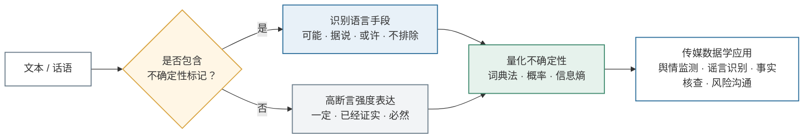
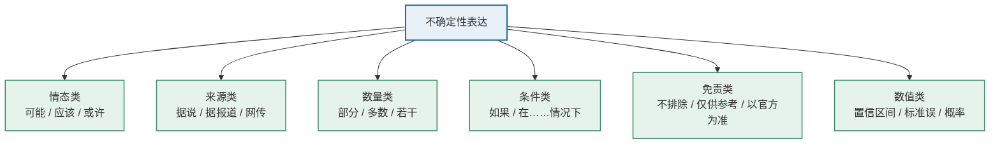
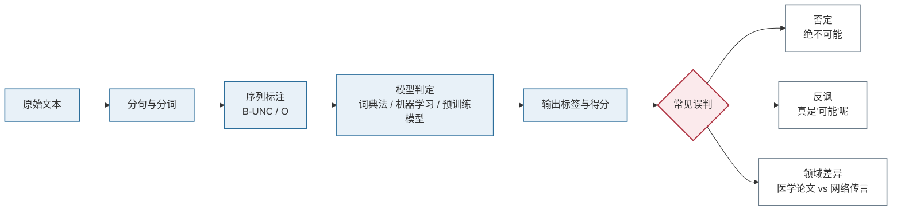

# 不确定性表达

- **姓名**：刘玉洁
- **学号**：202513093070
- **课程**：传媒数据学
- **认领词条**：不确定性表达

---

## 一、定义

**不确定性表达**（uncertainty expression），在语言学中也常称为**模糊限制语**（hedging）或**认识情态表达**，指说话者或写作者在文本中用来表示下述信息的语言手段：自己对某个命题的真假、对信息的来源与可靠程度、或对结论的推断强度**没有十足把握**，因而主动保留余地、降低断言强度。

用一句话概括：**不确定性表达就是"我对这件事有多确定"在语言上的显性标记。**

在传媒数据学中，该词条还包含一层计算含义：把文本中的不确定性表达识别出来，并转化为可以统计、比较和建模的**不确定性特征**。若用 $U(d)$ 表示文本 $d$ 的不确定性程度，可用词典法给出一个最简形式：

$$
U(d)=\frac{1}{N}\sum_{i=1}^{N} w_i \cdot \mathbb{I}(t_i \in L_u)
$$

其中 $N$ 为文本词数，$t_i$ 为第 $i$ 个词，$L_u$ 为不确定性词表，$w_i$ 为词权重，$\mathbb{I}(\cdot)$ 为指示函数（条件成立取 $1$，否则取 $0$）。$U(d)$ 越大，表示文本整体越倾向于保留、犹豫或弱断言。

## 二、背景和上下文

### 2.1 语言学背景

不确定性表达的研究可追溯到语言学家 Lakoff 于 1972 年提出、1973 年正式发表的"hedges"概念，此后在学术写作、语篇分析和情态研究中不断发展。Hyland 对学术论文的研究发现，研究者常用 *may*、*suggest*、*to some extent* 等表达来避免绝对化，从而为结论留下被修正的空间。这类表达并非"说话没水平"，而是一种成熟的**语用策略**。

### 2.2 传媒与传播学背景

新闻传播场景中，不确定性表达尤其常见，因为它同时承担三种功能：

1. **认识功能**：如实反映信息的不完整，如"据初步调查"。
2. **修辞与社交功能**：缓和语气、避免冒犯，如"这可能只是我的个人看法"。
3. **责任规避功能**：在信息未经完全核实的情况下留出回旋余地，如"不排除……的可能"。

在**舆情监测、谣言识别、事实核查、风险沟通、健康传播**等场景中，不确定性表达是一个关键信号：它既可能是专业审慎的体现，也可能被用来包装未经证实的信息。

### 2.3 传媒数据学中的位置

传媒数据学关注"用数据方法研究传媒现象"。不确定性表达因此从语言现象转化为**文本特征**，进入以下任务：

- 情感分析与立场分析：区分"我支持"与"我可能支持"；
- 舆情预警：统计某话题中不确定性表达的占比变化；
- 虚假信息检测：识别"据说""网传""不排除"等高风险话语标记；
- 生成式人工智能内容检测：判断模型输出是否进行了恰当的置信度表达。

## 三、举例说明

### 3.1 新闻文本

> 据知情人士透露，该公司**可能**于下半年启动重组，具体方案**尚未确定**。

- "据知情人士透露"：信息来源不确定；
- "可能"：事件发生概率不确定；
- "尚未确定"：事件状态本身不确定。

### 3.2 社交媒体文本

> 听说这次考试要改革？应该不会吧，我也不太确定。

"听说""应该""不太确定"层层叠加，使整句话的断言强度显著降低。若用情感分析模型只看"不会"，可能误判为确定否定；只有结合不确定性表达，才能读出说话者的犹豫。

### 3.3 学术与研究文本

> 结果**在一定程度上**支持了原假设，但样本量有限，因果关系**仍有待进一步检验**。

这里的不确定性表达是学术规范的一部分，用于界定结论的适用边界。

### 3.4 数据与算法文本

除自然语言外，不确定性也可以用数值表达，例如预测区间 $[a,b]$、标准误 $\mathrm{SE}$、置信区间 $[L,U]$、概率 $p$。这类"数值型不确定性"与"语言型不确定性"在传媒数据学中经常需要联合分析。

**常见语言手段对照表：**

| 类型 | 典型词语 | 作用 |
| --- | --- | --- |
| 情态动词 | 可能、或许、应该、可以 | 表示可能性或义务强度 |
| 模糊限制语 | 似乎、大概、据说、据报道 | 弱化断言或标明来源 |
| 数量模糊 | 部分、某些、若干、多数 | 回避精确数量 |
| 条件句 | 如果、假如、在……情况下 | 限定结论成立条件 |
| 免责声明 | 不排除、仅供参考、以官方为准 | 降低承诺与责任 |
| 数值表达 | 置信区间、标准误、概率 | 量化不确定性 |

## 四、对比分析

### 4.1 与确定性表达的区别

确定性表达如"一定""必然""已经证实""毫无疑问"，其断言强度高；不确定性表达则降低断言强度。二者构成**断言强度连续统**，可写为：

$$
\text{确定} \;>\; \text{较确定} \;>\; \text{可能} \;>\; \text{不确定}
$$

在计算建模中，这通常被映射为 $[0,1]$ 区间上的置信度，例如：

$$
c(t)=\sigma(z)=\frac{1}{1+e^{-z}}
$$

其中 $z$ 为模型给出的证据得分，$c(t)$ 越接近 $1$ 表示越确定。

### 4.2 与模糊表达的区别

**模糊**（vagueness）指词语边界不清晰，例如"年轻人"到底指几岁到几岁；**不确定性**指说话者对命题真假缺乏把握，例如"他可能是年轻人"。前者是**语义边界问题**，后者是**认识态度问题**。用模糊集合可以刻画前者：

$$
\mu_A(x)\in[0,1]
$$

表示元素 $x$ 属于集合 $A$ 的程度，而不是"是或不是"的二值判断。

### 4.3 与歧义、虚假信息的区别

- **歧义**（ambiguity）：一个表达存在多种解释，如"咬死了猎人的狗"；
- **不确定性表达**：说话者承认自己不确定；
- **虚假信息**：内容与事实不符，可能被表达得很确定，也可能用不确定性表达作掩护。

因此，**"用了不确定性词"不等于"信息一定不可靠"**，必须结合语境、来源与事实核查综合判断。

### 4.4 与情感表达的区别

情感分析关注**评价倾向**（正面/负面），不确定性表达关注**认识态度**（确定/不确定）。例如"这可能是好事"包含正面情感，同时具有明显的不确定性。两套特征需要分别建模，也可组合使用。

## 五、深入扩展：不确定性的类型、度量与算法

### 5.1 不确定性类型

1. **认识不确定性**（epistemic uncertainty）：知识不足导致，如"我们尚不清楚原因"；
2. **偶然不确定性**（aleatory uncertainty）：事件本身随机，如"明天下雨的概率为 $60\%$"；
3. **模型不确定性**（model uncertainty）：模型设定或参数不唯一导致；
4. **语用不确定性**：出于礼貌、修辞或责任规避而刻意保留余地。

### 5.2 度量方法一：词典与规则法

词典法将文本切分为词序列后，统计不确定性词命中情况，即前文的 $U(d)$。其优点是透明、可解释，缺点是难以处理否定、反讽和语境。为此可加入否定窗口修正：

$$
U'(d)=U(d)-\lambda \cdot U_{\text{neg}}(d)
$$

其中 $U_{\text{neg}}(d)$ 为被否定词修饰的不确定性表达得分，$\lambda$ 为惩罚系数。

### 5.3 度量方法二：概率与信息熵

若把某话题在文本中被支持的概率记为 $p$，则该分布的信息熵为：

$$
H(X)=-\sum_{i=1}^{n} p(x_i)\log_2 p(x_i)
$$

当两种可能各占 $50\%$ 时，二值熵取最大值：

$$
H_{\max}=-\left(\frac{1}{2}\log_2\frac{1}{2}+\frac{1}{2}\log_2\frac{1}{2}\right)=1 \text{ bit}
$$

熵越大，表示观点分布越分散、**舆论越不确定**。该指标常用于舆情监测中的"意见分化度"测量。

### 5.4 度量方法三：贝叶斯更新

不确定性会随新证据而改变。设 $H$ 为假设，$E$ 为新证据，则：

$$
P(H \mid E)=\frac{P(E \mid H)\,P(H)}{P(E)}
$$

$P(H)$ 是先验概率，$P(H \mid E)$ 是后验概率。随着可靠证据不断累积，后验分布通常更集中，即不确定性下降。这为"舆情反转"提供了形式化解释：新证据改变了公众对事件为真的信念分布。

### 5.5 自动识别流程与评价

一个典型的不确定性表达识别流程为：

> 文本获取 → 分词与句法分析 → 特征抽取 → 序列标注/分类模型 → 输出不确定性标签

标签体系常采用 BIO 形式，例如"可能"被标注为 `B-UNC`、"应该"为 `B-UNC`，非不确定性词为 `O`。模型方面，早期多使用 SVM、CRF 等方法，如今多使用 BERT 等预训练语言模型。分类概率常由 softmax 给出：

$$
P(y=k \mid x)=\frac{\exp(z_k)}{\sum_{j=1}^{K}\exp(z_j)}
$$

评价指标包括精确率 $P$、召回率 $R$、$F_1$ 值：

$$
F_1=2\cdot\frac{P\cdot R}{P+R}
$$

人工标注的一致性可用 Cohen's $\kappa$ 衡量：

$$
\kappa=\frac{p_o-p_e}{1-p_e}
$$

其中 $p_o$ 为观察一致率，$p_e$ 为随机一致率。按照 Landis 与 Koch 提出的经验标准（Landis & Koch, 1977），$\kappa$ 在 $0.81\sim1.00$ 表示几乎完全一致，$0.61\sim0.80$ 表示高度一致，低于 $0.40$ 则说明标注标准需要重新界定。

### 5.6 主要挑战

- **语境依赖**："可能"有时表示不确定，有时只是客气；
- **否定与反讽**："绝不可能"含有"可能"，但表达的是高确定性；
- **领域差异**：医学论文中的 hedging 与网络传言中的 hedging 功能不同；
- **标注主观性**：不同标注者对"不确定程度"的判断可能不一致；
- **模型校准**：模型输出的高概率不一定代表真实可信，可用期望校准误差衡量：

$$
\mathrm{ECE}=\sum_{m=1}^{M}\frac{|B_m|}{n}\left|\mathrm{acc}(B_m)-\mathrm{conf}(B_m)\right|
$$

## 六、可视化理解

> 本节所有图形均使用 **GitHub 原生支持**的格式：Mermaid 流程图、表格与文本图，**无需任何外部图片文件**，粘贴到 GitHub 后可直接渲染。

### 6.1 总览：从语言现象到数据特征

不确定性表达研究要回答的是一条完整链路：文本中**有没有**不确定性标记、**属于什么类型**、**程度多高**，以及最终**能用来做什么分析**。



**一句话读图**：从左到右是"文本 → 判定 → 分类识别 → 量化 → 应用"；上方分支走"不确定性表达"，下方分支走"高断言表达"，两条路都要进入量化环节。

### 6.2 断言强度标尺

不确定性表达并不只有"有或没有"，而是一条从"完全确定"到"完全不确定"的连续刻度：

```text
确定 ←──────────────────────────────────────────────────────────→ 不确定

 一定      已经证实     多数情况下      可能/或许      据说/网传     不排除/尚无定论
  │           │             │              │              │              │
 1.0         0.9           0.7            0.5            0.3            0.1
（断言强）                                                              （断言弱）
```

| 刻度 | 典型表达 | 参考置信度 $c(t)$ | 传播含义 |
| --- | --- | --- | --- |
| 强断言 | 一定、必然、已经证实 | $0.9\sim1.0$ | 信息被当作事实传播，责任最重 |
| 较强断言 | 多数情况下、基本可以确认 | $0.7\sim0.9$ | 留有小幅修正空间 |
| 弱断言 | 可能、或许、倾向于认为 | $0.4\sim0.6$ | 承认存在其他可能 |
| 弱化表达 | 据说、网传、据报道 | $0.2\sim0.4$ | 把判断责任转移给信息源 |
| 高度不确定 | 不排除、尚无定论、有待核实 | $0.0\sim0.2$ | 明确表示结论未定 |

> 表中的参考置信度 $c(t)$ 是示例性刻度，用于帮助理解，不是统一测量标准；真实研究需依据语料和标注规范确定。

### 6.3 不确定性表达的类型地图

不确定性表达并非零散的几个词，而可以归入六大类，每一类都有典型的词语标记：



**一句话读图**：同一句"我不确定"，可能属于情态类（可能、应该），也可能属于来源类（据说、网传）——**分类不同，后续的量化权重和传播含义也不同**。

### 6.4 量化示例：一句话的不确定性得分

按前文词典法公式 $U(d)=\frac{1}{N}\sum_{i=1}^{N} w_i \cdot \mathbb{I}(t_i \in L_u)$，设不确定性词表 $L_u$ 及权重为：可能 $=1.0$、据……透露 $=1.0$、网传 $=1.0$，其余词为 $0$（下列 $N$ 为示意性简化分词结果，不计标点）。对四个例句计算：

| 例句 | 切分词数 $N$ | 命中词及权重 | 加权命中 $U_{\text{raw}}$ | 归一化得分 $U(d)$ |
| --- | --- | --- | --- | --- |
| 公司可能启动重组 | 4 | 可能（1.0） | 1.0 | 0.250 |
| 据知情人士透露，公司可能于下半年启动重组 | 9 | 据……透露（1.0）、可能（1.0） | 2.0 | 0.222 |
| 网传该公司将于下半年启动重组 | 8 | 网传（1.0） | 1.0 | 0.125 |
| 该公司将于下半年启动重组 | 7 | 无 | 0.0 | 0.000 |

```text
U(d)
0.250 | ████████████████████  公司可能启动重组
0.222 | █████████████████     据知情人士透露，公司可能于下半年启动重组
0.125 | ██████████            网传该公司将于下半年启动重组
0.000 |                       该公司将于下半年启动重组
      +---------------------→
```

可以看到：第二句虽然命中两个不确定性表达（$U_{\text{raw}}=2.0$），但因句子更长、分母 $N$ 更大，归一化得分反而略低于第一句。这提示我们：**$U_{\text{raw}}$ 反映"不确定性表达的绝对数量"，$U(d)$ 反映"不确定性表达的相对密度"，两者应结合报告。**

### 6.5 信息熵：舆论不确定度的可视化

设某话题被支持的概率为 $p$，则二值情形下的信息熵为：

$$
H(p)=-\left[p\log_2 p+(1-p)\log_2(1-p)\right]
$$

| 支持概率 $p$ | 反对概率 $1-p$ | 信息熵 $H(p)$ / bit | 舆论状态 |
| --- | --- | --- | --- |
| 0.50 | 0.50 | 1.000 | 完全分化，最不确定 |
| 0.60 | 0.40 | 0.971 | 高度分化 |
| 0.70 | 0.30 | 0.881 | 明显分化 |
| 0.80 | 0.20 | 0.722 | 意见开始集中 |
| 0.90 | 0.10 | 0.469 | 意见高度集中 |
| 1.00 | 0.00 | 0.000 | 完全一致，无不确定性 |

```text
H(p) / bit
1.00 |              ●
     |            ●   ●
0.75 |          ●       ●
     |        ●           ●
0.50 |      ●               ●
     |    ●                   ●
0.25 |  ●                       ●
     |●                           ●
0.00 +--------------------------------●
     0    0.25    0.50    0.75    1.00   p
```

曲线在 $p=0.5$ 处最高（$H=1$ bit），向两端递减。在舆情分析中，可以把 $H(p)$ 作为"意见分化度"指标：**熵越高，说明舆论越不确定、越容易发生反转。**

### 6.6 识别流程与常见误判

不确定性表达的自动识别是一条标准流水线，但每一环都可能被语境"骗"到：



**文字版流程**：原始文本 → 分句分词 → 序列标注（B-UNC / O）→ 模型判定 → 输出标签与得分，再进入"常见误判"检查。

| 易错类型 | 例子 | 表层特征 | 真实含义 |
| --- | --- | --- | --- |
| 否定 | 绝不可能发生 | 含"可能" | 高确定性否定 |
| 反讽 | 他"可能"会来吧（嘲讽语气） | 含"可能" | 实际表达怀疑或否定 |
| 双层不确定 | 我不确定他是否会来 | 含"不确定" | 指向说话者自身状态，而非事件概率 |
| 领域差异 | 本研究结果提示…… | 学术 hedging | 学术规范，不等于信息不可靠 |

**一句话看懂本节**：不确定性表达是一条**刻度**（6.2）、一个**谱系**（6.3）、一个**可计算的分数**（6.4）、一条**熵曲线**（6.5），也是一张**容易踩坑的识别流程图**（6.1 / 6.6）。
## 七、在传媒数据学中的应用场景

1. **舆情监测**：追踪话题中不确定性表达的比例，判断舆论是否仍处于"未定"阶段；
2. **谣言与虚假信息检测**：将"网传""据说""不排除"等话语标记纳入特征体系；
3. **事实核查与新闻质量评估**：区分"证实"与"可能"，评估报道的严谨程度；
4. **风险与健康传播**：在不确定情境下，恰当的不确定性表达有助于维持公众信任；
5. **生成式人工智能治理**：检测大语言模型是否存在"过度自信"或"幻觉性断言"；
6. **推荐与用户研究**：分析用户评论中的犹豫表达，理解其决策心理。

## 八、简明总结

- **是什么**：不确定性表达是说话者用来表示"不完全确定、保留余地"的语言手段，核心是断言强度的调节。
- **为什么重要**：它影响信息可信度、舆论走向与传播责任，是传媒数据学中的重要文本特征。
- **怎么用**：既可用词典法、信息熵、贝叶斯更新等传统方法度量，也可用 BERT 等模型自动识别。
- **关键区分**：不确定性表达不同于模糊、歧义和虚假信息；它本身是中性的，既可以体现审慎，也可能被用来规避责任。
- **一句话记忆**：**不确定性表达就是文本中"把握程度"的显性刻度，而传媒数据学的任务，是把这个刻度读出来、量出来、用起来。**

## 参考文献（延伸阅读）

1. Lakoff, G. (1973). Hedges: A study in meaning criteria and the logic of fuzzy concepts. *Journal of Philosophical Logic*, 2(4), 458–508. https://doi.org/10.1007/BF00262952 （"hedges"概念最早见于 1972 年芝加哥语言学会会议论文）
2. Hyland, K. (1998). *Hedging in Scientific Research Articles*. John Benjamins. https://doi.org/10.1075/pbns.54
3. Palmer, F. R. (2001). *Mood and Modality* (2nd ed.). Cambridge University Press. https://doi.org/10.1017/CBO9781139167178
4. Shannon, C. E. (1948). A mathematical theory of communication. *Bell System Technical Journal*, 27(3), 379–423. https://doi.org/10.1002/j.1538-7305.1948.tb01338.x
5. Cohen, J. (1960). A coefficient of agreement for nominal scales. *Educational and Psychological Measurement*, 20(1), 37–46. https://doi.org/10.1177/001316446002000104
6. Landis, J. R., & Koch, G. G. (1977). The measurement of observer agreement for categorical data. *Biometrics*, 33(1), 159–174. https://doi.org/10.2307/2529310
7. Jurafsky, D., & Martin, J. H. (2009). *Speech and Language Processing* (2nd ed.). Pearson Prentice Hall. （第 3 版草稿见 https://web.stanford.edu/~jurafsky/slp3/）

