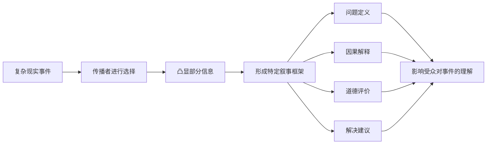
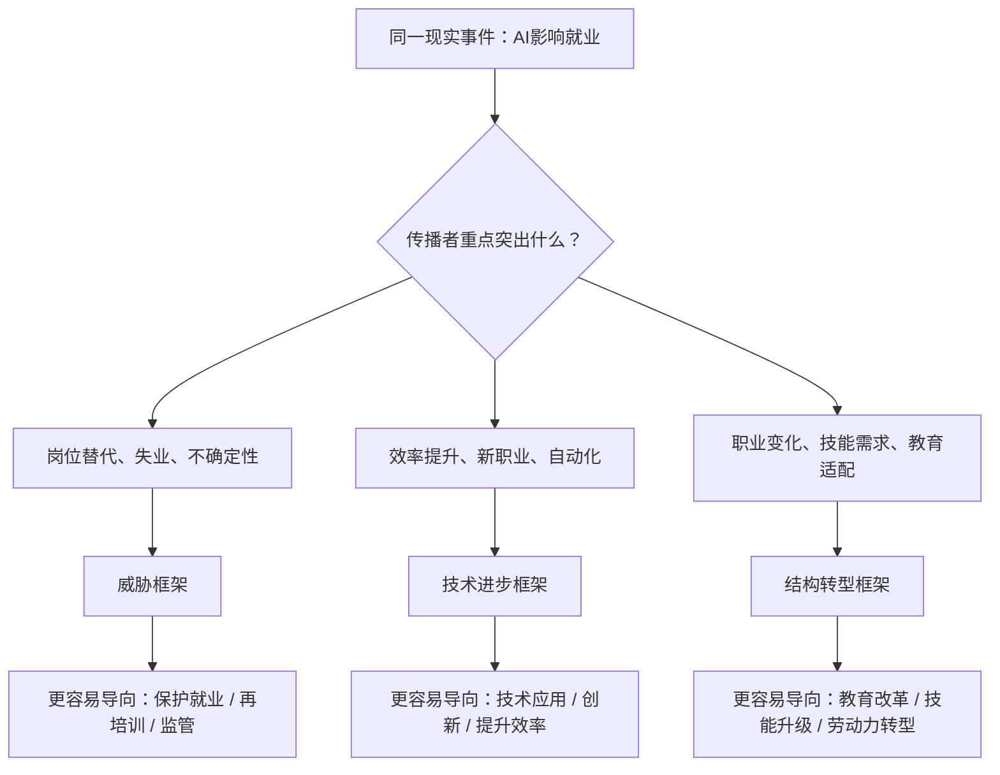
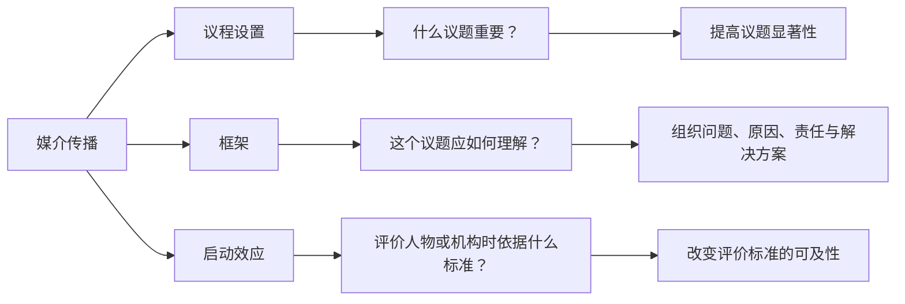
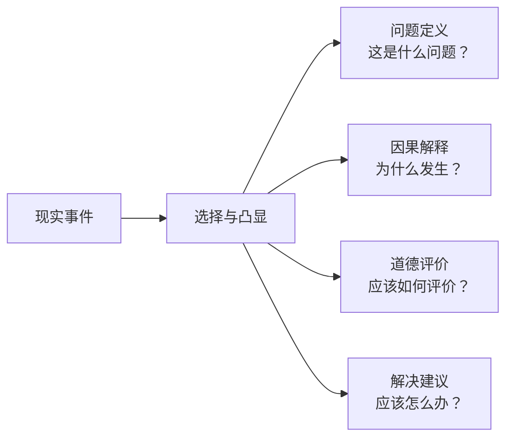
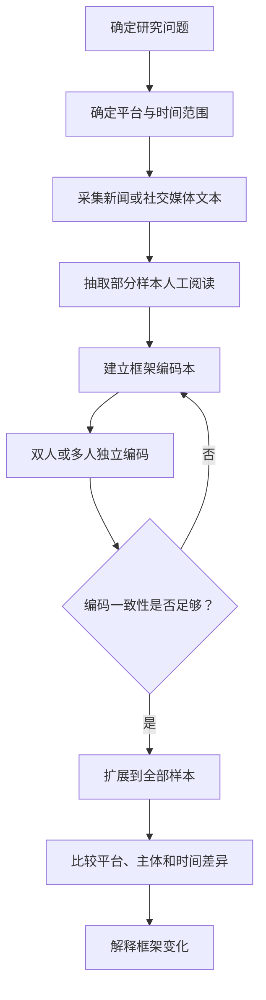
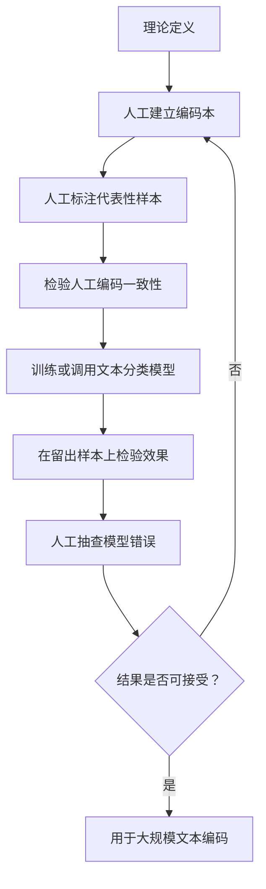

# 框架理论

> **姓名：** 周牧伯
> **学号：** 202418093016

---

## 一、定义名词

**框架理论（Framing Theory）**是传播学、新闻学和社会学中用于解释“传播者如何组织现实意义”的经典理论视角。其关注的是媒体或其他传播主体**如何选择、组织并突出事件中的某些信息，使受众更容易以某种方式理解事件**。

Robert M. Entman（1993）将框架的核心概括为两个过程：**选择（selection）**与**凸显（salience）**。传播者从复杂现实中选择某些方面，并通过标题、叙事结构、信源选择、因果解释等方式提高其显著性，从而推动某种特定的问题定义、原因解释、道德评价或解决建议。

因此，框架理论可以用下面语言概括：

> **同一件事情可以被以不同方式讲述，而不同的讲述方式会使不同的问题、原因、责任和解决方案变得更加突出。**

需要注意的是，框架并不等于“虚假信息”或“媒体操纵”。现实本身包含大量信息，传播必须进行选择与组织。框架理论研究的重点，是这种选择**突出什么、弱化什么，以及它如何影响对现实的理解**。


### 图1：框架形成逻辑



---

## 二、背景和上下文

### 2.1 理论来源

框架概念的重要思想来源之一是社会学家 **Erving Goffman**。在《Frame Analysis: An Essay on the Organization of Experience》（1974）中，Goffman讨论了人们如何借助框架回答：

> “这里正在发生什么？”

因此，框架最初更多被理解为一种帮助人们组织经验、识别情境的认知结构。

传播学中的框架研究进一步把这一问题扩展到新闻生产、政治传播和公共讨论。**Robert M. Entman** 在1993年的经典论文 *Framing: Toward Clarification of a Fractured Paradigm* 中，对传播研究中的框架概念进行了系统梳理，并提出了传播文本中框架常见的四种功能。

随后，**Dietram A. Scheufele（1999）**进一步区分了：

- **媒体框架（media frames）**：新闻或传播文本如何组织和呈现事件；
- **受众框架（individual/audience frames）**：受众头脑中用于理解事件的认知结构。

这一区分突出了以下部分：

> **媒体中存在某种框架，不等于受众一定按照同样的框架理解事件。**

### 2.2 框架理论的重要性

现实事件通常包含大量主体、原因和结果，而一篇报道、一段视频或一则官方声明不可能完整呈现全部信息。传播者必须不断做出选择，例如：

- 哪些事实进入报道；
- 哪些人物获得发言机会；
- 哪些原因被强调；
- 谁被描述为主要责任主体；
- 哪些后果被重点呈现；
- 什么解决方案被认为值得讨论。

这些选择共同塑造了一个事件“应该如何被理解”。

因此，框架理论广泛应用于：

- 新闻报道研究；
- 政治传播；
- 公共政策传播；
- 品牌危机与公共关系；
- 风险传播；
- 国际传播；
- 健康传播；
- 社交媒体舆情研究等。

---

## 三、举例说明

以“人工智能对就业产生影响”为例。

假设不同媒体都在报道“部分岗位受到生成式人工智能影响”这一现象，但它们可以使用完全不同的框架。

### 3.1 威胁框架

报道主要强调：

- 部分工作岗位可能被自动化替代；
- 从业者面临失业风险；
- 劳动力市场存在不确定性。

此时事件可能被定义为：

> **人工智能正在构成新的就业风险。**

在这种框架下，解决方案通常更容易指向就业保护、再培训或监管。

### 3.2 技术进步框架

报道重点可能变成：

- 人工智能提高生产效率；
- 重复性劳动被自动化；
- 新技术可能创造新的职业岗位。

此时事件被定义为：

> **人工智能正在推动生产方式升级。**

同一技术变化由“威胁”转变为“生产力提升”。

### 3.3 结构转型框架

另一种报道可能既不单纯强调威胁，也不只强调效率，而是关注：

- 哪些职业受到影响；
- 哪些技能需求增加；
- 教育与劳动力市场是否能够适应变化。

此时问题被定义为：

> **人工智能正在推动职业结构和技能结构重新调整。**

可以看到，三个报道面对的现实事件大体相同，但它们分别把注意力导向了：

**风险、技术收益和结构变化。**

这就是框架的基本作用：它不一定改变事实本身，却会改变**哪些事实最突出，以及这些事实之间如何被组织成一种解释**。


### 图2：同一事件如何产生不同框架



---

## 四、对比分析

框架理论容易与议程设置、启动效应、主题分析和情绪分析混淆。

### 4.1 框架理论与议程设置

| 理论 | 核心问题 | 示例 |
|---|---|---|
| **议程设置** | 哪些议题被认为重要？ | 媒体持续报道“AI就业”，使其进入公众关注议程 |
| **框架理论** | 一个议题应当如何理解？ | AI就业被描述为“威胁”“技术进步”或“结构转型” |

简单来说：

> **议程设置更关注“想什么”，框架理论更关注“怎么想”。**

两者并不冲突。媒体可以先通过高频报道提高某议题的显著性，再通过特定框架组织对该议题的解释。

### 4.2 框架理论与启动效应

启动效应（Priming）主要关心：

> **当某些议题长期或集中出现后，人们是否更倾向用这些议题作为评价某个人或机构的标准？**

例如，如果公众长期接触经济问题报道，在评价政府时可能更强调经济表现。

因此：

- **议程设置**：什么重要；
- **框架**：如何理解；
- **启动**：用什么标准评价。


### 图3：议程设置、框架与启动效应的区别



> **议程设置决定“看什么”，框架影响“怎么看”，启动效应影响“拿什么标准去评价”。**

### 4.3 框架与主题的区别

“主题（Topic）”回答：

> 这段文本在讨论什么？

“框架（Frame）”回答：

> 这段文本如何解释这件事？

例如：

- “食品安全”是**主题**；
- “企业逐利导致食品安全问题”是一种**责任归因框架**；
- “监管制度失效导致食品安全问题”则是另一种框架。

因此，主题模型得到的“主题簇”不能直接当作框架。

### 4.4 框架与情绪的区别

情绪分析主要判断文本表达了：

- 正面；
- 中性；
- 负面；

或者愤怒、恐惧、喜悦等具体情绪。

框架分析则关心：

- 问题被如何定义；
- 原因被归于谁；
- 谁承担责任；
- 哪些解决方案得到支持。

所以：

> **“负面报道”本身不是一个完整的框架。**

---

## 五、深入扩展

### 5.1 Entman的四种框架功能

Entman（1993）提出，传播中的框架通常体现以下一种或多种功能。

#### （1）问题定义（Problem Definition）

回答：

> 发生了什么问题？

例如，青年就业问题可以被定义为：

- 经济增长问题；
- 教育结构问题；
- 劳动力技能问题；
- 个体就业选择问题。

#### （2）因果解释（Causal Interpretation）

回答：

> 为什么发生？是谁或什么导致的？

例如：

- 企业岗位缩减；
- 产业结构变化；
- 教育培养与市场需求错位；
- 求职者技能不足。

#### （3）道德评价（Moral Evaluation）

回答：

> 应该如何评价相关主体？

例如：

- 企业是否负责任；
- 某项政策是否公平；
- 某种行为是否合理。

#### （4）解决建议（Treatment Recommendation）

回答：

> 应该怎么办？

例如：

- 加强监管；
- 调整教育培养方案；
- 企业提供补偿；
- 推动职业培训。

这四种功能可以整理为：



---

### 5.2 新闻研究中的五类常见框架

Semetko 与 Valkenburg（2000）在对新闻报道进行内容分析时，使用并检验了五类常见新闻框架。

| 框架 | 核心问题 | 典型表现 |
|---|---|---|
| **责任归因框架** | 谁造成问题或应该解决问题？ | 强调政府、企业、个人等主体的责任 |
| **冲突框架** | 谁与谁存在分歧？ | 强调党派、组织、群体之间的冲突 |
| **人情框架** | 普通人如何受到影响？ | 使用个人故事、情绪和具体经历 |
| **经济后果框架** | 带来了什么经济影响？ | 强调成本、收入、就业、市场变化 |
| **道德框架** | 应如何从价值层面评价？ | 强调道德原则、规范或价值判断 |

这五类框架非常适合作为新闻研究的起点，但并不意味着所有研究都必须使用固定分类。

框架研究一般存在两种思路：

1. **演绎式（deductive）**：先依据既有理论建立框架类别，再进行编码；
2. **归纳式（inductive）**：先阅读材料，再从文本中归纳框架。

前者更适合比较研究，后者更适合探索新议题。

---

### 5.3 如何把框架理论做成一项数据研究

以“比较不同平台如何框架AI就业问题”为例，可以按照以下流程进行。



其中“一致性不足则返回修改编码本”的过程很重要，因为框架首先是一个**需要被可靠测量的理论构念**。

例如，可以建立如下数据表：

| id | platform | date | actor | frame |
|---|---|---|---|---|
| 001 | 新闻媒体 | 2026-01-01 | 媒体 | 威胁框架 |
| 002 | 社交平台 | 2026-01-01 | 用户 | 个体责任框架 |
| 003 | 企业账号 | 2026-01-02 | 企业 | 技术进步框架 |

如果要计算平台中某框架的占比，可以使用：

$$
P(F_k \mid P_j)=\frac{N(F_k,P_j)}{N(P_j)}
$$

其中：

- $F_k$：第 $k$ 类框架；
- $P_j$：第 $j$ 个平台；
- $N(F_k,P_j)$：平台 $P_j$ 中属于框架 $F_k$ 的文本数量；
- $N(P_j)$：平台 $P_j$ 中全部研究文本数量。

这样可以回答：

> 不同平台是否更倾向使用不同的解释框架？

---

### 5.4 编码一致性

框架是一种理论构念，因此不能只依靠研究者“感觉”判断。

如果由两名编码者判断同一批文本，可以使用 **Cohen's Kappa** 等指标检验一致性：

$$
\kappa=\frac{P_o-P_e}{1-P_e}
$$

其中：

- $P_o$：两名编码者实际观察到的一致比例；
- $P_e$：在随机情况下预期的一致比例。

相比简单的“一致率”，Kappa进一步考虑了偶然一致的可能。

如果一致性较低，通常说明：

- 框架定义过于模糊；
- 不同类别之间重叠严重；
- 编码说明不够明确；
- 样本本身存在较大歧义。

此时应修改编码本。

---

### 5.5 一个简单的数据统计示例

假设框架已经通过人工或模型完成标注，可以使用 Python 计算不同平台的框架分布。

```python
import pandas as pd

df = pd.read_csv("framing_data.csv")

# 统计不同平台中各类框架数量
frame_count = (
    df.groupby(["platform", "frame"])
      .size()
      .reset_index(name="count")
)

# 计算各平台内部框架比例
frame_count["ratio"] = (
    frame_count["count"]
    / frame_count.groupby("platform")["count"].transform("sum")
)

print(frame_count)
```

输出可以进一步整理为：

| platform | frame | count | ratio |
|---|---|---:|---:|
| 新闻媒体 | 威胁框架 | 120 | 0.40 |
| 新闻媒体 | 技术进步框架 | 90 | 0.30 |
| 新闻媒体 | 结构转型框架 | 90 | 0.30 |

随后可以继续使用卡方检验等方法判断不同平台的框架分布是否存在统计差异。

但统计显著性只能说明**分布差异**，不能自动解释差异为什么产生，更不能自动证明某种框架造成了受众态度变化。

---

### 5.6 计算传播中的框架识别

当文本规模很大时，可以结合自然语言处理方法。

一种较稳妥的流程是：



计算传播中的一个核心原则：**模型不是替代理论，而是在理论定义和人工验证之后扩大分析规模。**

可使用的方法包括：

- 传统机器学习分类；
- BERT等预训练语言模型；
- 大语言模型辅助编码；
- 文本嵌入与聚类作为探索工具。

其中最重要的一点是：

> **模型可以帮助扩大编码规模，但理论构念仍然需要由研究者定义和验证。**

如果模型只是根据高频词进行分类，却不能区分“谁导致问题”“如何评价责任”等解释结构，那么它识别的可能只是主题，而不是框架。

---

### 5.7 使用边界

#### 第一，框架不能等同于关键词

一篇文本出现大量“责任”“企业”“赔偿”等词，并不意味着它必然采用责任归因框架。

关键是这些信息有没有组成明确的解释关系。

#### 第二，框架不能等同于主题

主题说明“讨论了什么”，框架说明“如何理解它”。

因此，LDA等主题模型得到的主题不能未经人工解释就直接命名为传播框架。

#### 第三，媒体框架不等于受众框架

发现新闻文本大量使用某种框架，只能说明该框架在媒体内容中具有显著性。

如果要证明：

> 某种框架改变了公众态度，

通常还需要实验、问卷调查、追踪数据或其他效果研究设计。

#### 第四，相关关系不等于框架效果

例如发现“责任框架越多，评论越负面”，不能直接得出：

> 责任框架导致了负面情绪。

因为还可能存在事件严重程度、平台差异、用户群体等混杂因素。

#### 第五，框架具有情境性

新闻框架会随：

- 媒体类型；
- 文化背景；
- 历史时期；
- 议题类型；
- 传播主体；

而变化。

因此，经典框架可以作为参考，但不能机械套用。

---

## 六、简明总结

框架理论关注的是：

> **传播者如何通过选择与凸显信息，赋予现实事件特定的解释方式。**

其核心可以概括为四个问题：

1. **这是什么问题？**
2. **为什么会发生？**
3. **应该如何评价？**
4. **应该如何解决？**

框架理论与议程设置、启动效应关系密切，但关注重点不同：

- 议程设置强调**什么重要**；
- 框架理论强调**如何理解**；
- 启动效应强调**依据什么标准评价**。

在数据研究中，框架理论可以通过内容分析、人工编码、统计检验以及自然语言处理等方法进行操作化。但需要始终注意：

> **关键词不是框架，主题不是框架，情绪也不是框架；媒体中存在一个框架，更不等于已经证明它对公众产生了因果效果。**

正因为框架理论既能解释新闻和社交媒体中的意义建构，又能够与内容分析和计算传播方法结合，它成为了传播学中应用范围广、研究传统成熟、同时具有较强数据分析可操作性的理论之一。

---

## 参考文献

1. Goffman, E. (1974). *Frame Analysis: An Essay on the Organization of Experience*. Cambridge, MA: Harvard University Press.

2. Entman, R. M. (1993). Framing: Toward Clarification of a Fractured Paradigm. *Journal of Communication*, 43(4), 51–58. https://doi.org/10.1111/j.1460-2466.1993.tb01304.x

3. Scheufele, D. A. (1999). Framing as a Theory of Media Effects. *Journal of Communication*, 49(1), 103–122. https://doi.org/10.1111/j.1460-2466.1999.tb02784.x

4. Semetko, H. A., & Valkenburg, P. M. (2000). Framing European Politics: A Content Analysis of Press and Television News. *Journal of Communication*, 50(2), 93–109. https://doi.org/10.1111/j.1460-2466.2000.tb02843.x
